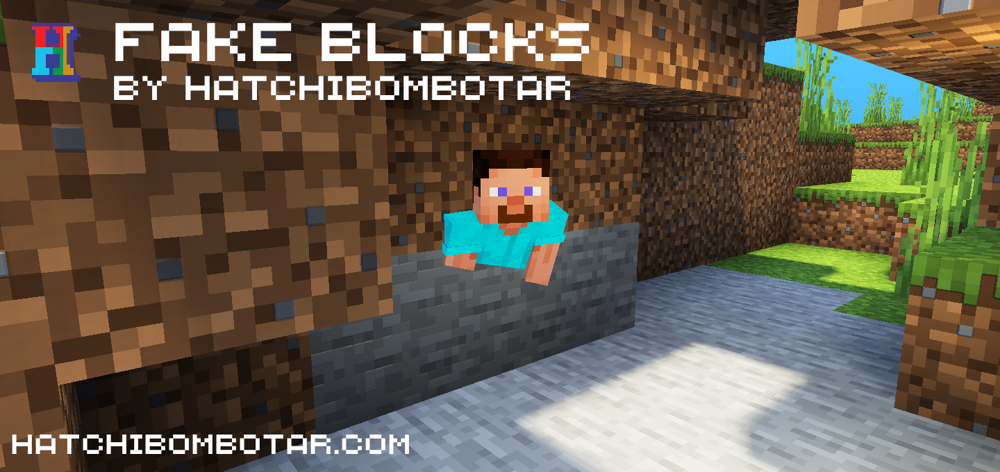
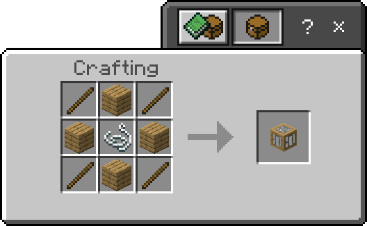

# Fake Blocks Add-On
Last release tested for version 1.20.70.

An add-on for Minecraft: Bedrock Edition that allows you to create pretend/camouflage blocks that you can walk, and fall through. With this add-on you can create secret bases, cool traps and creative builds.

To use it, first craft a fake block with the below recipe:

Now hold the block you want the fake block to look like and interact with the block. This only works with solid blocks.

Requires following experimental toggles:
- Beta APIs

[Download](https://github.com/Hatchibombotar/fake-blocks-addon/releases/download/latest-build/fake-blocks.addon)
