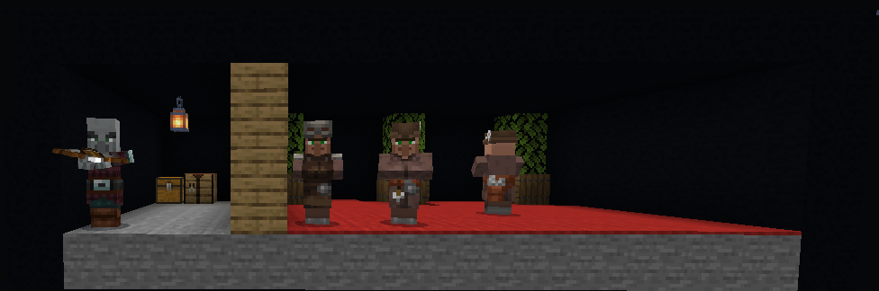
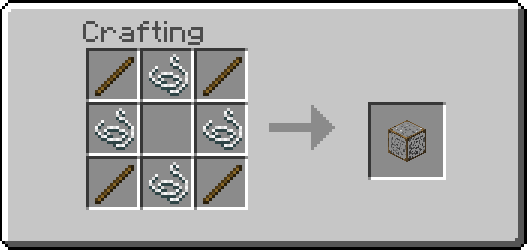

# Fake blocks addon

## [Download](https://github.com/Hatchibombotar/fake-blocks-addon/releases/download/v1.0.0/fake_blocks.mcaddon)

An addon for Minecraft: Bedrock Edition that allows you to create pretend blocks that you can walk through.

_A secret base_

## Using the addon
To use it combine any solid block with the empty fake block in the crafting grid.

_Empty fake block crafting recipe_

## Addon Info
This addon was created with [regolith](https://bedrock-oss.github.io/regolith/). The blocks are automaticly generated with a script.
